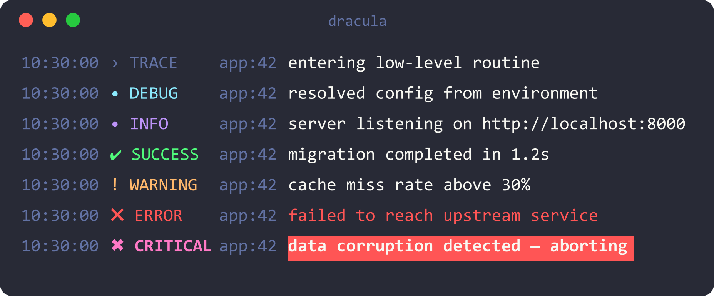
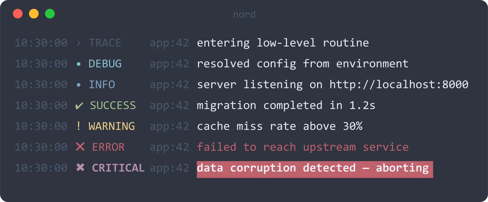
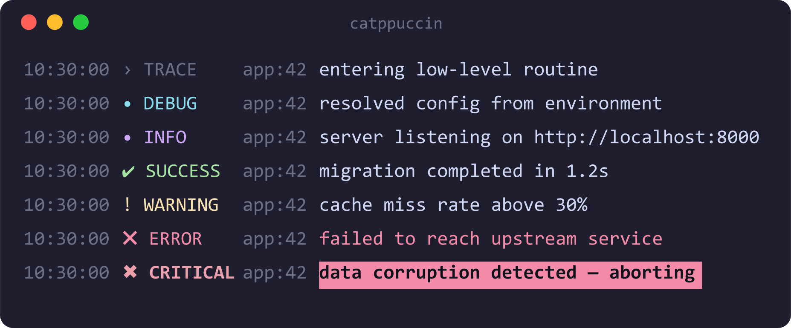
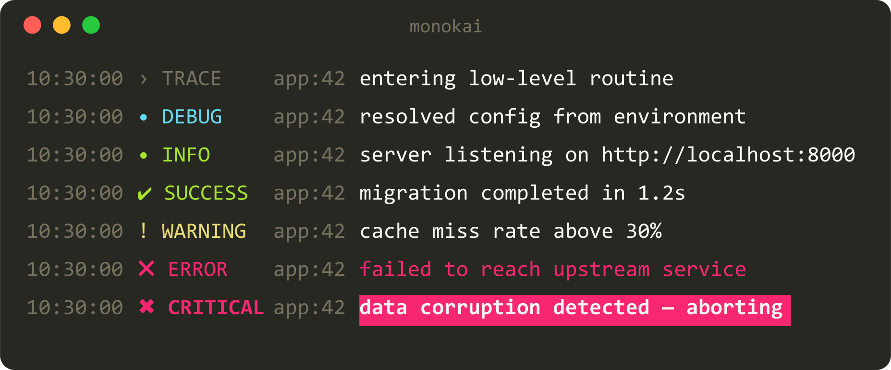
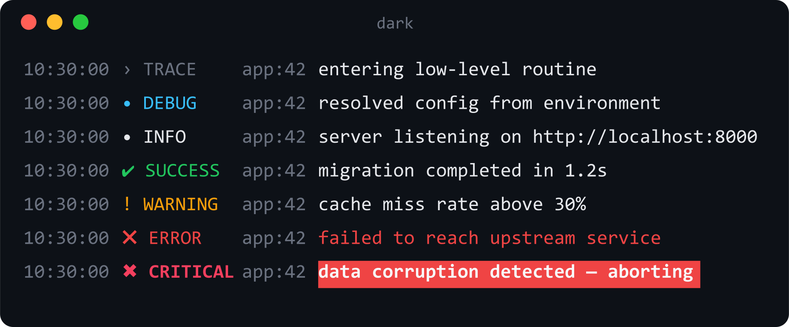
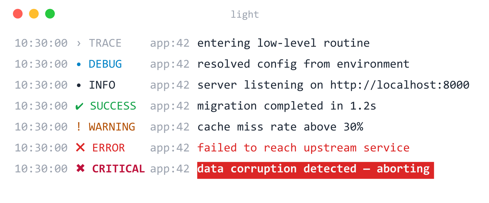

# loguru-themes

Curated color themes and minimalist Unicode level icons for [loguru](https://github.com/Delgan/loguru) — applied to any logger in one call.

### 📖 Documentation & live previews → **https://0cherednoq.github.io/loguru-themes/**

## Install

```bash
pip install loguru-themes
```

## Quick start

```python
from loguru import logger
from loguru_themes import apply_theme

apply_theme(logger, "dracula")

logger.info("server listening on http://localhost:8000")
logger.success("migration completed in 1.2s")
logger.warning("cache miss rate above 30%")
logger.error("failed to reach upstream service")
logger.critical("data corruption detected — aborting")
```

## Themes

`dracula` · `nord` · `catppuccin` · `monokai` · `dark` · `light`

<table>
  <tr>
    <td></td>
    <td></td>
  </tr>
  <tr>
    <td></td>
    <td></td>
  </tr>
  <tr>
    <td></td>
    <td></td>
  </tr>
</table>

Customizing themes, icons, the color-scheme remapping, and using your own logger
are all covered in the **[documentation](https://0cherednoq.github.io/loguru-themes/)**.

## License

MIT
