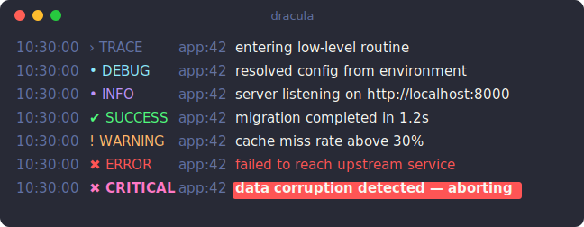

## Install

```bash
pip install loguru-themes
```

Requires Python 3.9+ and `loguru>=0.7` (installed automatically).

## Apply a theme

One call configures the console sink — format, per-level colors, and icons:

```python
from loguru import logger
from loguru_themes import apply_theme

apply_theme(logger, "dracula")

logger.trace("entering low-level routine")
logger.debug("resolved config from environment")
logger.info("server listening on http://localhost:8000")
logger.success("migration completed in 1.2s")
logger.warning("cache miss rate above 30%")
logger.error("failed to reach upstream service")     # red message text
logger.critical("data corruption detected — aborting")  # bold on red background
```

`apply_theme` takes over the logger's console output (it removes existing
handlers — the idiomatic loguru setup) and installs a single themed sink. Each
level gets its theme color, and the level icon shares that color.



## Choosing a theme

Pass any built-in name (autocompleted by your IDE) or a `Theme` object:

```python
apply_theme(logger, "nord")
apply_theme(logger, "catppuccin")
```

See [Themes](../themes/) for the full list, or [Customizing](../customizing/) to
tweak one.

## What's next

- [Themes](../themes/) — the built-in palettes and how to list them
- [Icons](../icons/) — change or disable the per-level icons
- [Customizing](../customizing/) — derive your own theme
- [Color scheme](../color-scheme/) — native color tags follow the theme
- [Use your own logger](../own-logger/) — keep your own sinks and format
