import { Card, CardGrid } from '@astrojs/starlight/components';

## Установка

```bash
pip install loguru-themes
```

```python
from loguru import logger
from loguru_themes import apply_theme

apply_theme(logger, "dracula")

logger.info("server listening on http://localhost:8000")
logger.success("migration completed in 1.2s")
logger.warning("cache miss rate above 30%")
logger.error("failed to reach upstream service")
logger.critical("data corruption detected — aborting")
```

<CardGrid stagger>
  <Card title="Готовые темы" icon="seti:default">
    `dracula`, `nord`, `catppuccin`, `monokai`, плюс нейтральные `dark` и `light`.
  </Card>
  <Card title="Один вызов" icon="rocket">
    `apply_theme(logger, "dracula")` задаёт формат, цвета уровней и иконки.
  </Card>
  <Card title="Юникод-иконки" icon="star">
    Минималистичные символы на уровень (`✔ ✖ ! • ›`) — без спец-шрифтов.
  </Card>
  <Card title="Полноценная цветовая схема" icon="puzzle">
    Нативные теги loguru (`<red>`, `<blue>`, …) следуют палитре темы.
  </Card>
</CardGrid>

## Превью тем

Пример вывода всех уровней под каждой встроенной темой:


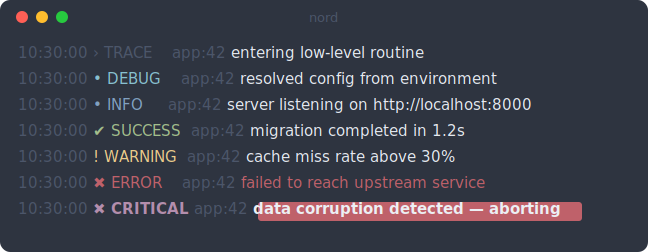
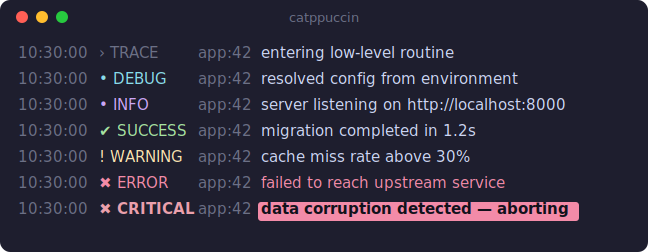
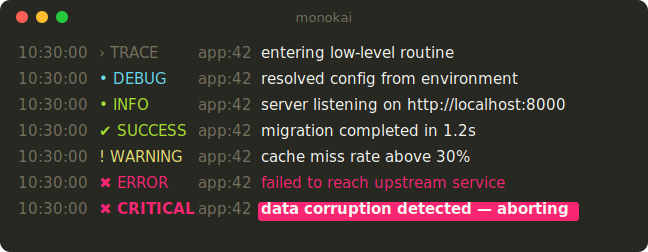
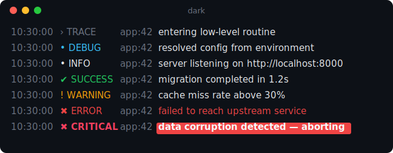
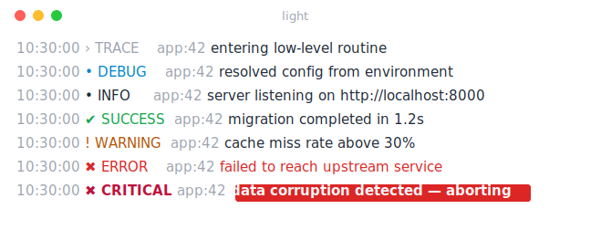

## Логи с цветными фонами

Логи — это не только цветной текст: теги можно подсвечивать на фоновых цветах
палитры темы (текст автоматически контрастный для читаемости):

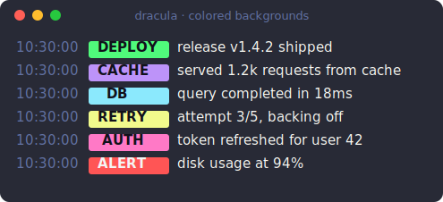
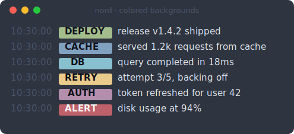
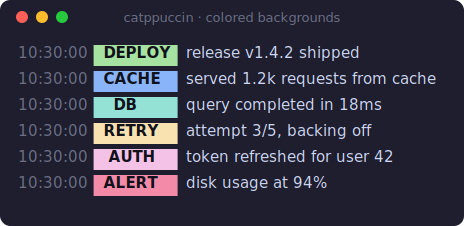
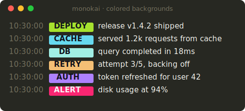
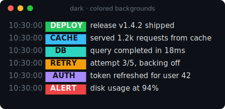
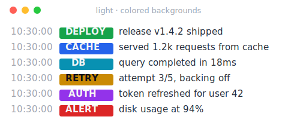

Полная палитра каждой темы — на странице [Темы](themes/).

Дальше — [Начало](getting-started/).
