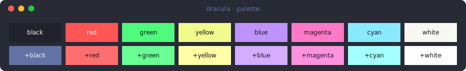
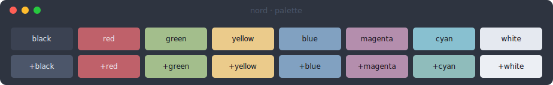
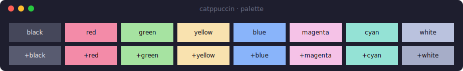
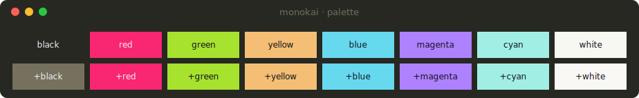
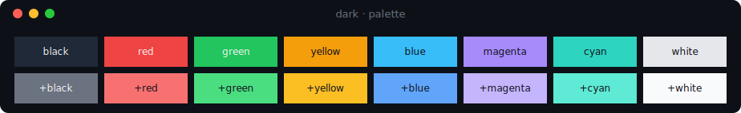
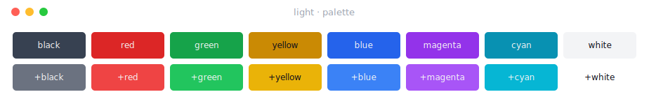

## Встроенные темы

| Имя          | Источник                          |
| ------------ | --------------------------------- |
| `dracula`    | JetBrains / палитра Dracula       |
| `nord`       | Nord                              |
| `catppuccin` | Catppuccin (Mocha)                |
| `monokai`    | Monokai                           |
| `dark`       | Нейтральная тёмная (в стиле CLI)  |
| `light`      | Нейтральная светлая (для светлого терминала) |

Применить по имени:

```python
from loguru import logger
from loguru_themes import apply_theme

apply_theme(logger, "monokai")
```

## Превью

Пример вывода всех уровней под каждой темой (имя темы — в заголовке окна):


## Палитра (фоновые цвета)

16-цветная палитра каждой темы — именно в эти цвета мапятся нативные теги вроде
`<red>` / `<RED>`:













## Список тем

```python
from loguru_themes import list_themes

list_themes()
# ['catppuccin', 'dark', 'dracula', 'light', 'monokai', 'nord']
```

Имена регистронезависимы (`"Dracula"` сработает). Неизвестное имя вызывает
`KeyError` со списком доступных тем.

## Получить объект темы

```python
from loguru_themes import get_theme

theme = get_theme("dracula")
theme.levels["INFO"].color   # '#bd93f9'
theme.accent, theme.dim, theme.fg
```

Полезно, когда нужно осмотреть или [кастомизировать](../customizing/) тему,
либо сослаться на её цвета в [своём формате](../own-logger/).

## Подсветка

- **ERROR** — текст сообщения красный (как в стандартном `logging`).
- **CRITICAL** — сообщение жирным на красном фоне, чтобы выделяться.

Оба настраиваются на уровень — см. [Кастомизацию](../customizing/).

## Светлая и тёмная

`dark`/`light` подобраны под тёмный/светлый фон терминала соответственно;
`dracula`, `nord`, `catppuccin` и `monokai` — палитры для тёмного фона.
